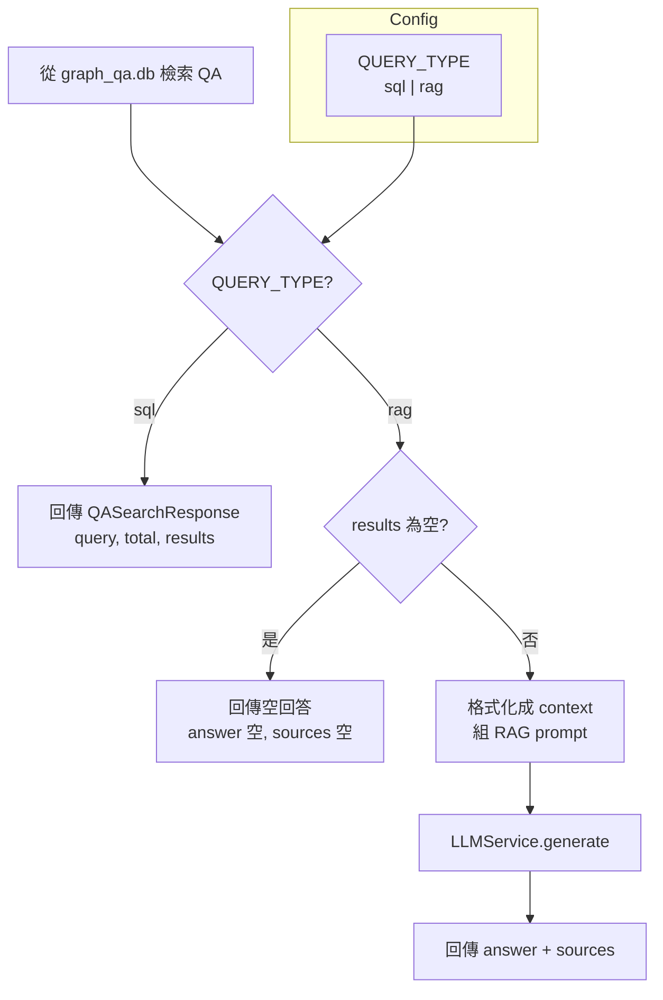
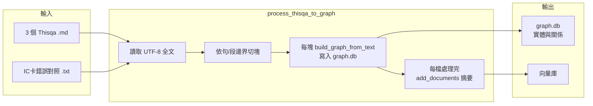

# QUERY_TYPE 環境變數實作計畫（sql / RAG）

**更新時間**：2026-03-06  
**作者**：AI Assistant  
**修改摘要**：Phase 2 已完成；新增 scripts/process_thisqa_to_graph.py（依句/段切塊、--reset、建圖+向量），計畫狀態更新為 Phase 2 已完成。

**更新時間**：2026-03-06  
**作者**：AI Assistant  
**修改摘要**：為計畫加入狀態標記（Phase 1 已完成、Phase 2 待實作）；Phase 1 各小節與附錄 B 檢查項以 [x]/[ ] 標示。

**更新時間**：2026-03-06  
**摘要**：以環境變數 QUERY_TYPE（.env / .env.local）控制 QA 搜尋為「僅回傳列表（sql）」或「LLM 產出單一回答（rag）」；計畫存於 docs/thisqa 供實作依循。

**狀態**
- **Phase 1（QUERY_TYPE 端點）**：已完成
- **Phase 2（regen graph.db / process_thisqa_to_graph）**：已完成

**目錄**
1. 總覽（可行性、RAG vs SQL 優缺點）
2. 架構與資料流（Phase 1 Mermaid、Phase 2 regen graph.db）
3. Phase 1 實作項目（設定、端點、Schema、依賴、文件）
4. 注意事項與實作順序
5. 附錄 A：graph.db 來源與 Thisqa 替換
6. 附錄 B：Phase 2 實作檢查項

---

## 1. 總覽

### 1.1 可行性與結論

**結論：可行，建議實作。**

- **sql**：維持目前 `app/api/v1/endpoints/qa.py` 作法，用 `SQLiteGraphStore(graph_qa.db)` 做多欄位、多關鍵字 AND 檢索，直接回傳 `QASearchResponse`（QA 列表），不經 LLM。
- **rag**：同一 QA 檢索邏輯不變，取得結果後將 QA 內容組合成 context，呼叫 `app/services/llm_service.py` 的 `generate(prompt)`，回傳「單一回答 + 引用來源（sources）」。

說明：主線 GraphRAG 為 `app/core/orchestrator.py`（graph.db + 向量 + LLM），與 graph_qa.db 分開。本需求僅在 QA 搜尋上依 QUERY_TYPE 分支。

### 1.2 RAG vs SQL：優缺點與選擇建議

- **SQL**：延遲低、無 LLM 成本、可預測性高、合規容易；缺點為僅關鍵字匹配、回傳多筆列表。
- **RAG**：單一整合回答 + 引用、對自然語友善；缺點為延遲較高、LLM 成本、依賴 API。
- **建議**：以環境變數切換，依環境或產品需求選擇。

---

## 2. 架構與資料流

### 2.1 Phase 1：QA 搜尋端點（QUERY_TYPE）

- **sql**：回傳 `QASearchResponse(query, total, results)`。
- **rag**：若 results 為空則回傳空回答；若有結果則 format context、組 RAG prompt、呼叫 `LLMService.generate`，回傳 `answer` + `sources`。

### 2.2 Phase 2：regen graph.db（與 QUERY_TYPE 獨立）— 已完成

- Phase 2 供主線 GraphRAG（`/api/v1/query`）使用，不改變 QA 搜尋端點。Phase 1 不需等待 regen graph.db 即可上線。

---

## 3. Phase 1 實作項目（QUERY_TYPE）— 已完成

### 3.1 設定與環境變數 [x]

- [x] `app/config.py`：新增 `QUERY_TYPE: str = "sql"`；可選 `load_dotenv(".env.local")`（若存在）；若值非 sql/rag 則 fallback `sql`；`get_query_type()` 驗證。
- [x] `env.example`：增加註解與 `QUERY_TYPE=sql` 範例。

### 3.2 QA 搜尋端點依 QUERY_TYPE 分流 [x]

- [x] `app/api/v1/endpoints/qa.py`：POST /search 與 GET /search 共用同一邏輯。先檢索得 `results`，讀取 `get_query_type()`。**sql**：回傳現有 response。**rag**：若 results 非空則組 context（限制長度）、組 prompt、呼叫 LLM，回傳 answer + results；若空則 answer 空；LLM 失敗時 fallback 回傳 results、answer=None 並 log。
- [x] RAG prompt 範例：「以下為參考 Q&A：\n{context}\n\n請根據以上內容簡要回答使用者問題，若無法從參考中回答請註明。\n\n使用者問題：{query}」
- [x] Context 長度：`RAG_CONTEXT_MAX_ITEMS`、`RAG_CONTEXT_MAX_CHARS` 限制送入 LLM 的筆數或字元數。

### 3.3 Schema 擴充 [x]

- [x] `app/api/v1/schemas/qa.py`：`QASearchResponse` 增加 `answer: Optional[str] = None`。

### 3.4 依賴注入 [x]

- [x] qa.py 一律注入 `LLMService`（`Depends(get_llm_service)`），sql 分支不呼叫。

### 3.5 文件與範例 [x]

- [x] `docs/qa/qa_api_test_guide.md` 說明 QUERY_TYPE 與驗證建議；`dev_readme.md` 更新日期與 Phase 1 變更摘要。

---

## 4. 注意事項與實作順序（Phase 1）— 已完成

- **不更動**：`/api/v1/query`、orchestrator、graph.db、向量服務不變。
- **錯誤處理**：RAG 模式 LLM 失敗時 fallback 回傳原始 QA 列表（answer=None），並 log 錯誤。
- **實作順序**（已執行）：1) config 2) env.example 3) schema 4) qa endpoint 5) docs 6) 驗證（同一 query 分別 sql/rag 各呼叫一次）。

---

## 5. 附錄 A：graph.db 來源與 Thisqa 替換

- graph.db 目前由 PDF 經 `scripts/process_pdf_to_graph.py` 產生（擷取全文 → 分塊 → build_graph_from_text → 向量）。
- 可用 4 個 Thisqa 檔（3 .md + 1 .txt）替換：改為讀 .md/.txt 全文，**分塊策略採用依句/段邊界切塊**（.md 依 `## Q:` 或 `\n\n`；.txt 依雙換行或固定行數），其餘同。
- 腳本建議：`scripts/process_thisqa_to_graph.py`；選項 `--reset` 可先執行 reset_graph_db。主 Document 如 `doc_thisqa_billing`、`doc_thisqa_ic_error` 等。graph_qa.db 與 graph.db 為兩套圖，互不影響。

---

## 6. 附錄 B：Phase 2 實作檢查項（process_thisqa_to_graph.py）— 已完成

- [x] 輸入：4 檔路徑可設定或固定（預設 `data/Thisqa`，`--dir` 可覆寫）。
- [x] 文字取得：UTF-8 全文，輕量過濾 BOM（`read_utf8`）。
- [x] 分塊：依句/段邊界（.md：`## Q:` 或 `\n\n`；.txt：雙換行或固定行數）；單塊過大再次切分；僅無結構時 fallback 固定字數 + overlap。
- [x] 圖：每塊 `build_graph_from_text`，主 Document 實體 + 各 chunk Document，寫入 graph.db。
- [x] 向量：每檔處理完 `add_documents`（摘要前 5000 字）。
- [x] 選項：`--reset` 先執行 `reset_graph_db`。

**使用方式**：
- 僅建圖（附加到現有 graph.db）：`python scripts/process_thisqa_to_graph.py --dir data/Thisqa`
- 先清空 graph.db 再建圖：`python scripts/process_thisqa_to_graph.py --dir data/Thisqa --reset`
